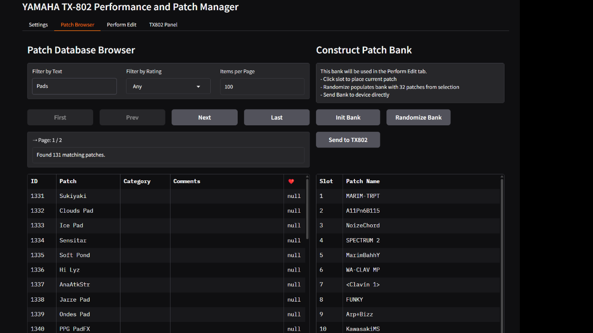
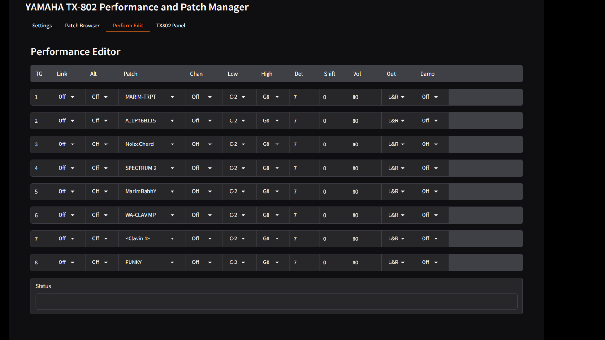
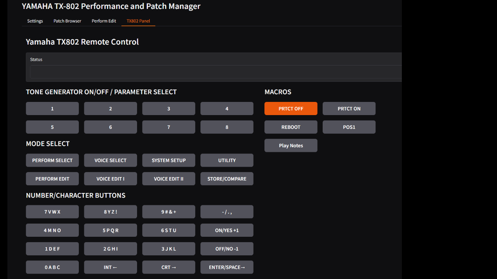
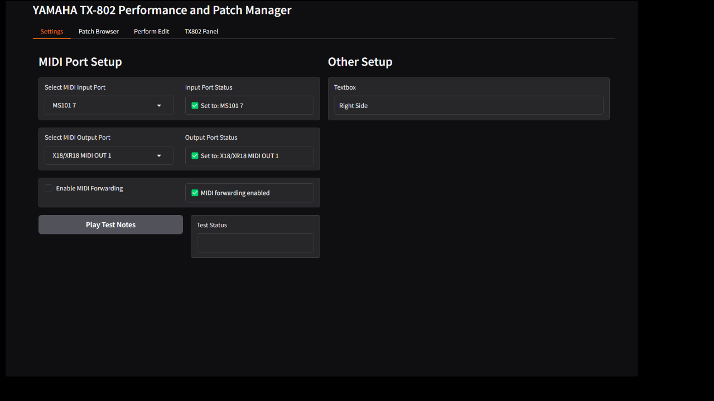

# 🎛️ 802 Manager
v1.2.2 | 2025-05-11 | Helge T. Kautz

### Design Philosophy
802 Manager was designed for studio use. It treats the TX802 purely as an external sound module and doesn't use any permanent on-device storage or RAM cartridges. Instead, all preset and performance data and the required state handling will be done exclusively via the 802 Manager.
### No MIDI return required
Since the 802 Manager puts the TX802 into a known good init state on application startup, and handles all state changes from there, no MIDI return channel is required. It is sufficient to connect your computer's MIDI OUT to the TX802's MIDI IN. 

**NOTE:** Many USB MIDI interfaces - despite being much newer than the TX802 - are unable to reliably handle fast or lage SysEx messages. For example, the popular MIDIFACE 2x2 falls into this category, whereas the MIDI Out of a Behringer XR18 rack mixer works as expected.
### Difficult things made easy
The new core library tx802_utils.py implements an abstraction layer that reduces the complexity of the TX802 to simple commands. For example, you can now just switch a Tone Generator (TG) on or off, instead of dealing with Yamaha's archaic 'voice linking' concept.

**NOTE:** TG1 will always remain On. While TG1 *can* be muted, the TX802 does *not* allow it to be set to Off.
### A word on terminology
* LINK becomes simply On/Off. **WHY?** The TX802 re-allocates TG polyphony automatically. No need to confuse users with arcane terminology.
* Voice (Data) and Patch become Preset. **WHY?** To consolidate useage of termss throughout the 802 Manager and reduce confusion.

**NOTE:** Don't read the official Yamaha documentation unless you absolutely must; it's more confusing than helpful.
### Preset Database and Browser
The 802 Manager comes with tens of thousands of presets consolidated from several sources on the internet. Presets with the same name but different sound parameters were kept; presets with different names but identical sound data were excluded. A Preset Browser with filter functionality was implemented. The Preset browser maintains its own audit settings to enable easy preset pre-listening.
### Performance Editor
The heart of the 802 Manager is its Performance Editor, that makes it very easy to layer and split sounds across the TX802’s 8 Tone Generators The selected settings are saved automatically so that the next time you use the app, the unit will be right back to where you left it.
### Front Panel Control
All tunctions available from the TX802's front panel can be controlled remotely now. Additionally, macro functions that aren't directly available on the front panel were also added, e.g. PRTCT_ON/PRTCT_OFF and RESET.
### Command Line Utilities
Optionally, the 802 Manager includes a number of command line tools with which all functionality of the TX802 can be remotely controlled using easy-to-understand commands (e.g. TG2=On, TG4=Off, PRESET2=I10, PAN2=Left, PAN3=Right, OUTVOL3=75, etc. The Front Panel can also be controlled from the command line.

### And More
The 802 Manager also includes the new dx7_utils.py library which implements a comprehensive set of preset management functions. It validates SysEx, can extract single presets from banks, create new banks from individual presets, handle the new preset database functions, make "surprise" banks and a lot more.

### 📸 Preset Browser & Performance Editor
 -

### 📸 Front Panel Control & Settings Page
 -

### 🔧 Installation
Please make sure git and Python are installed on your system.  It is recommended to use a virtual environment. For example, like this:
> git clone https://github.com/Helge666/802_Manager  
> cd 802_Manager  
> python -m venv .venv  
> .venv\Scripts\activate  
> pip install -r requirements.txt

After installation, start the TX802 Manager GUI with
> python app/main.py

Then open the GUI in e.g. Chrome by clicking on http://localhost:7860

**NOTE:** Why Python/Gradio? Well, if you have a hammer, every problem looks like a nail :-) Or in other words, I'm using Python/Gradio because I'm familiar with it. I'm not opposed to porting the 802 Manager to a prettier framework in the future.
### ✅ Tested With
- Windows 11 Pro
- Python 3.12+
- Gradio 5.25.2+
- Mido 1.3.3+
- python-rtmidi 1.5.8+

The application should also work on Linux and macOS, although this hasn't been tested yet. If you add support, please do so in an OS-agnostic way so the tool remains portable and platform-independent.

### 🧪 CLI Test Scenarios
**Tip:** Instead of the GUI, you can use the provided boilerplate scripts from the command line.

Observe the TX802 Panel; it should reflect the changes these scripts are sending.

**Send a complete preset bank (32 presets) to INT1-INT32**  
> python cli/tx802/send_preset_bank.py --bankfile assets/banks/surprise01.syx

**Send only first two presets**  
*(Unofficial workaround, may not correctly work depending on TX802 firmware)*  
> python cli/tx802/send_preset_bank.py --bankfile assets/banks/surprise01.syx --stopafter 2

**Send a single preset to the edit buffer**  
> python cli/tx802/send_single_preset.py --db config/dx_preset_library.sqlite3 --presetid 666

**Send a button macro**  
> python cli/tx802/press_button.py --buttons PERFORM_EDIT,TG8,TEXT="My Test Case"

**Send a performance bank**  
> python cli/tx802/send_perform_bank.py --bankfile banks/Factory_Sysex/TX802_Factory_Performances.syx

**Send performance parameter changes**  
> python cli/tx802/press_button.py --buttons PERFORM_EDIT,TG2  
> python cli/tx802/perform_edit.py --edits OUTVOL1=95,OUTVOL2=98

**Select the first preset in TG1**  
> python cli/tx802/perform_edit.py --edits PRESET1=I01

## 🤖 A Note on AI Assistance
This project was developed with the help of AI tools, but not through "Vibe Coding". As a veteran coder since before the TX802 even hit the market, I manually contributed code and reviewed the generated parts to the best of my ability. Or, as Inspector Sledge Hammer used to say right when the TX802 was state of the art: "Trust me, I know what I'm doing!"

### 📌 TODO
- Commit preset bank to unit on PE tab switch (if uncommitted)
- Add DB selector to Settings
- Use resolve_output_port() consistently.
- Add librarian features (add/save/delete presets and banks)
- Save bank to .syx file in Preset Librarian
- Make rating, category, and comments editable
- Add support for saving performances to syx or DB
- Maybe add a Preset Editor after all?

## 📚 Sources & Acknowledgements
**DX7 Preset Library**  
The `dx_preset_library.sqlite3` database includes curated presets from:

- https://bobbyblues.recup.ch/yamaha_dx7/dx7_patches.html
- https://homepages.abdn.ac.uk/d.j.benson/pages/html/dx7.html
- https://www.reddit.com/r/synthesizers/comments/e4jkt7/my_curated_dexeddx7_patches_3_banks/

Presets were deduplicated by their parameter data (not names). Identical-sounding presets with different names were excluded; different-sounding presets with the same name were retained. All meta-information (place of origin, source SysEx file, etc.) is stored alongside the preset in the database.

**TX802 Brochure Images**  
Scanned and uploaded by:  
- https://retrosynthads.blogspot.com/2013/06/yamaha-tx802-fm-ton-generator-truly.html

**Documentation PDFs & Manuals**  
Collected from various Usenet archives, forums, and synth enthusiast sites over the years. Some new reference documents were created during the development of this tool suite.

## License
This project is licensed under the [Creative Commons Attribution-NonCommercial 4.0 International License](https://creativecommons.org/licenses/by-nc/4.0/).
