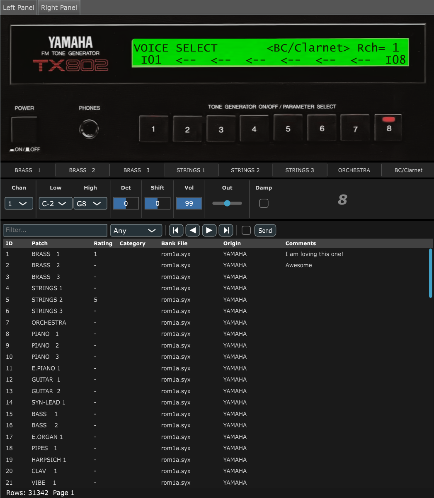
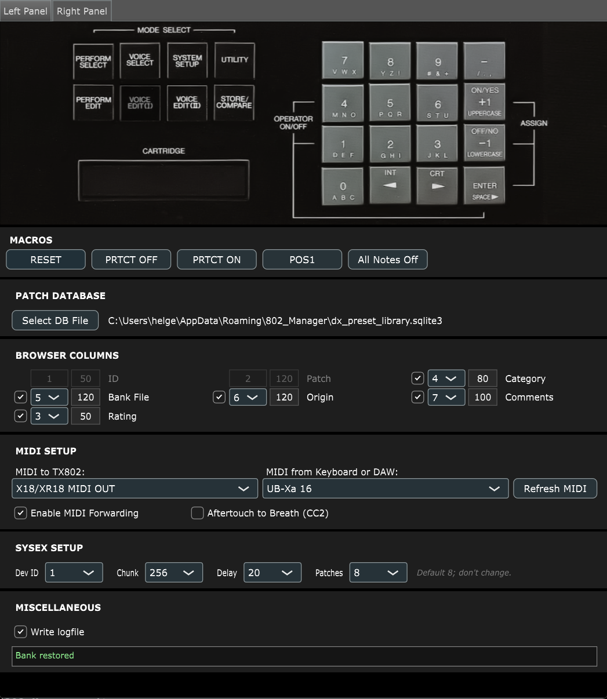

# 802 Manager

**Turn your Yamaha TX802 into a modern, effortless multi-timbral sound module.**

The TX802 is one of the most powerful FM synthesizers ever made — eight independent Tone Generators, each capable of playing a different sound simultaneously, with full per-voice control over channel, note range, volume, pan, detune, and more. Sonically, it still holds up in 2026. Operationally, navigating its tiny 1980s LCD and cryptic button sequences is a different story.

802 Manager connects to your TX802 via MIDI and takes over all configuration from the device itself. Set up your sounds once in a clean, modern interface. Every setting is saved automatically and restored on the next launch — your TX802 comes up exactly where you left it, every time.

---

### Left Panel — Tone Generator Control & Preset Browser

### Right Panel — Macros & Settings

---

## What it does

**31,000+ presets, instantly searchable.**
The included patch database is curated from the best DX7/TX802 patch collections available — deduplicated by sound data, with ratings, categories, and comments you can edit yourself directly in the browser.

**Layer and split across all 8 Tone Generators.**
Each TG gets its own preset, MIDI channel, note range, volume, pan, detune, and fine-tuning — all from a single screen, without touching the device.

**Fire and forget.**
The app initialises the TX802 on startup and restores your last session automatically. No RAM cartridges, no on-device storage. The app is the single source of truth.

**No LCD diving, ever.**
The TX802's arcane Voice Linking system, performance parameters, and front-panel functions are all surfaced as plain, readable controls. Even the terminology is simplified — *Link* becomes simply *On/Off*, *Voice Data* becomes *Preset*.

**MIDI thru.**
Route your keyboard or DAW through the app to the TX802. Optional Aftertouch-to-Breath (CC2) conversion included.

---

## Getting Started

1. Connect your computer's MIDI OUT to the TX802's MIDI IN. No MIDI return cable is needed.
2. Download the latest release: [github.com/Helge666/802_Manager/releases](https://github.com/Helge666/802_Manager/releases/)
3. Run `802_Manager.exe`. Windows will show an *Unknown Publisher* warning — choose *More Info → Run Anyway*.
4. Select your MIDI output port in the Settings tab. The app will initialise the TX802 and restore your last session.

> **Note on MIDI interfaces:** Some USB MIDI interfaces struggle with the large SysEx bursts the TX802 requires. The popular MIDIFACE 2x2, for example, is unreliable for this purpose. The MIDI output of a Behringer XR18 rack mixer works well.

---

## A Note on AI Assistance

This project was developed with the help of Claude (Anthropic). As a veteran coder since before the TX802 hit the market, I reviewed and contributed code throughout. Or, as Inspector Sledge Hammer used to say — right around the time the TX802 was state of the art — *"Trust me, I know what I'm doing."*

---

## Sources & Acknowledgements

**Preset Database**
The `dx_preset_library.sqlite3` database includes presets curated from:
- https://bobbyblues.recup.ch/yamaha_dx7/dx7_patches.html
- https://homepages.abdn.ac.uk/d.j.benson/pages/html/dx7.html
- https://www.reddit.com/r/synthesizers/comments/e4jkt7/my_curated_dexeddx7_patches_3_banks/

Presets were deduplicated by parameter data (not name). Identical-sounding presets with different names were excluded; different-sounding presets sharing a name were retained. Origin, source file, and other metadata are stored alongside each preset in the database.

**TX802 Brochure Images**
Scanned and uploaded by:
- https://retrosynthads.blogspot.com/2013/06/yamaha-tx802-fm-ton-generator-truly.html

---

## License

Copyright © 2025–2026 Helge T. Kautz

The original source code and assets in this repository are licensed under the
[GNU Affero General Public License v3.0 (AGPLv3)](https://www.gnu.org/licenses/agpl-3.0.html).
You are free to use, modify, and distribute this software — including for porting it to
other platforms — provided that any derivative work is also released under the AGPLv3.

**Third-party components**
- [JUCE](https://juce.com/) — © Raw Material Software / JUCE Ltd., licensed under the AGPLv3 for open-source use
- [SQLite](https://www.sqlite.org/) — public domain
